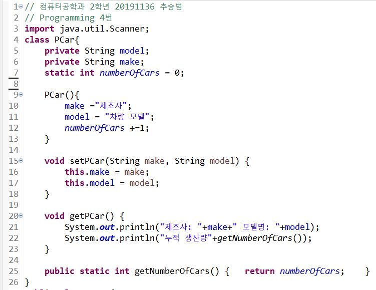
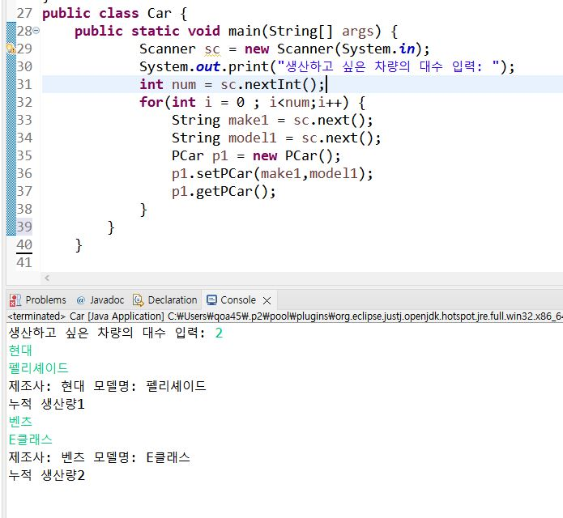

# 5장
## Mini Project 전기자동차
### 전기 자동차를 클래스로 작성해보자. 자동차는 완전(100%) 배터리로 시작한다. 자동차를 운전할 때마다 1km를 주행하고 배터리의 10%를 소모한다. 전기 자동차에는2가지 정보를 보여주는 디스플레이가 있다. 주행한 총 거리는 "주행거리: ...km", 남은 배터리 충전량은 "배터리: ...%"와 같이 표시된다.
### 배터리가 0%이면 더 이상 자동차를 운전할 수 없으며 "배터리 empty"와 같이 표시된다. 4개의 메소드를 가진 ECar 클래스를 구현해보자.
> 1. Ecar.getInstance() : 새로운 자동차를 생성하는 정적 메소드이다. 새로운 전기 자동차 인스턴스를 반환한다.
```
ECar car = ECar.getInstance();
```
> 2. dispDistance() : 주행 거리를 표시한다.
> 3. dispBattery() : 배터리 백분율을 표시한다.
> 4. drive() : 한 번 호출될 때마다 1km를 운행한다.
### 다음과 같이 실행된다.
``` java
ECar car = ECar.getInstacne();
car.drive();
car.drive();

car.dispDistance();     // 주행거리 2km
car.dispBattery();      // 배터리 80%
```
```
우선 조건과 키워드부터 확인합니다. '100%', '배터리', '1km', '10% 소모', '2가지 디스플레이', '0%이면 empty', '4개의 메소드'
ElecCar으로 클래스를 만들어주고 계산 해줄 필요가 있는 거리와 배터리를 각각 클래스 멤버 distance와 battery로 선언합니다.
distance는 0으로 초기화, battery는 100으로 초기화를 해줍니다.
문제에서 제시해준 4개의 메소드를 만들어줍니다.
dispDistance는 출력창에 주행거리가 출력되도록,
dispBattery는 출력창에 배터리 잔량이 %로 표시되도록 했으며 0% 일때는 empty로 표시하도록 했습니다.
drive는 한 번 호출될 때 1km를 운행하니 배터리를 10%를 깎아주며 10km를 다 달려서 배터리가 없다면 10km에서 더 증가되지 않도록 했습니다.
또한 전기 자동차 인스턴스를 반환하는 정적 메소드를 사용하기 위해 필드에 새로운 ElecCar객체를 생성하는 instance를 선언해줬습니다.
인스턴스를 반환하는 정적 메소드를 마지막에 사용해줬습니다.

메인 바디 부분에는 getInstance를 이용해서 새로운 전기 자동차 객체를 만들어주고
car.drive()를 4번 써줘서 4km를 이동하고 배터리는 40%를 사용하게 했으며
결과를 확인하기 위해 car.dispDistance()와 car.dispBattery()를 사용해서 결과가 맞게 출력되었음을 확인했습니다.

```


## Programming 1번
### 은행 계좌를 나타내는 BankAccount 클래스는 잔액을 나타내는 balance 필드를 가지고 있다. 생성자, 설정자, 접근자도 추가하라. 이 클래스에 계좌 간 이체 기능을 수행하는 메소드 transfer(int amount, BankAccount otherAccount)를 추가하고 테스트하라. transfer()는 현재 객체의 잔액에서 amount만큼을 ohterAccont 계좌로 송금한다.

``` java
public static void main(String[] args){
  BankAccount a1 = new BankAccount(10000);
  BankAccount a2 = new BankAccount(0);
  System.out.println("a1: "+a1);
  System.out.println("a2: "+a2+"\n");
  a1.transfer(1000,a2);
  System.out.println("a1: "+a1);
  System.out.println("a2: "+a2);
}
```
```
문제에서 제시해준대로 잔액을 표시하는 balance를 클래스 멤버로 선언합니다. 잔액을 지정한 만큼 가지는 계좌를 만드는 생성자를 하나 만들고
계좌를 이체할 수 있게 transfer 메소드를 생성해서 현재 계좌의 잔액에서 amount 만큼 빼고 다른 계좌에 amount 만큼 더하게 메소드를 만듭니다.
접근자를 사용하지 않고 결과를 실행하게되면 암호화된 문자열이 출력되므로 설정자와 접근자를 추가해서
private으로 지정된 balance 값을 읽을 수 있게 해줍니다.

메인 바디 부분에서는 각각 10,000원과 0원을 가진 계좌를 만들고 만들었을 당시 계좌의 잔액을 출력
transfer를 이용해서 계좌 이체를 수행한 후의 계좌 잔액을 출력하도록 합니다.

```


## Programming 4번
### 자동차 회사에서 지금까지 생산한 자동차의 대수를 정적 변수를 이용하여 계산하려고 한다. Car 클래스에 모델 이름(model), 생산자(make) 등의 필드를 정의하고, 여기에 지금까지 생산된 자동차의 대수를 나타내는 정적 변수 numbersOfCars를 추가한다. 이 정적 변수를 외부로 반환해주는 정적 메소드 getNumberOfCars()도 정의해서 사용해보자. 생정자, 설정자, 접근자도 적절하게 추가하라.
```
자동차 1대 생산, 누적 생산량 = 1대
자동차 1대 생산, 누적 생산량 = 2대
자동차 1대 생산, 누적 생산량 = 3대
```
```
자동차의 대수는 문제에서 제시한 numberOfCars를 정적 변수로 선언했고 model과 make를 문자열으로 선언했습니다.
매개 변수가 없는 생성자를 만들어서 객체를 만들 때 초기에 값이나 문자열을 받지 않도록 했고
설정자와 접근자를 추가해서 제조사와 모델의 이름을 받아오고 읽도록 했습니다.

메인 바디 부분은 스캐너를 이용해서 직접 만들고싶은 제조사와 모델을 적을 수 있도록 했고
미리 생산하고싶은 차량의 수를 입력하도록 해서 반복문의 반복횟수를 받아와서
객체를 반복해서 만들도록 했습니다.
```




## Programming 7번
### 간단한 영한 사전을 객체 배열을 이용하여 만들어보자. 클래스 Word는 영어 단어를 나타내는 eng, 한국어 단어를 나타내는 kor을 필드로 가진다. 클래스 Word의 객체 배열을 만들어서 여기에 몇 개의 단어쌍을 저장한다. 이 객체 배열을 이용하여 사용자가 입력하는 영어 단어가 배열 안에 있으면 대응되는 한국어 단어를 출력한다.
* 실행결과
```
검색할 영어 단어를 입력하시오(종료는 quit) : house
house -> 집
검색할 영어 단어를 입력하시오(종료는 quit) : learning
사전에 없는 단어입니다.
검색할 영어 단어를 입력하시오(종료는 quit) : quit
```


