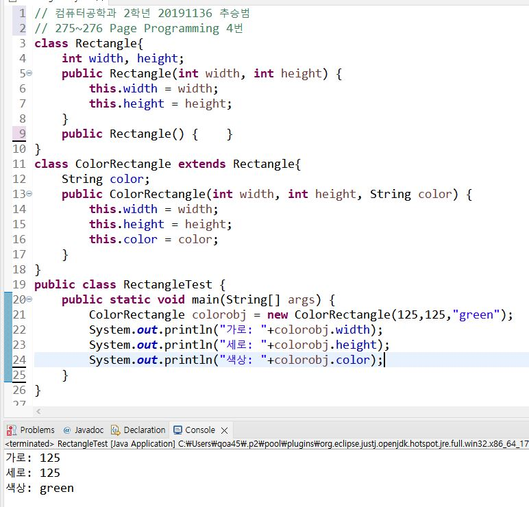
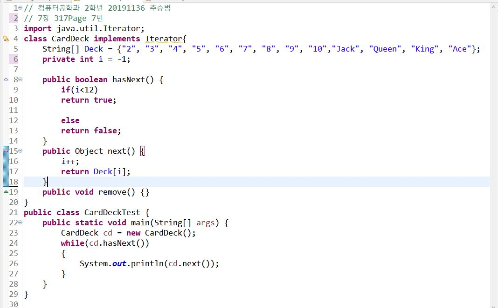
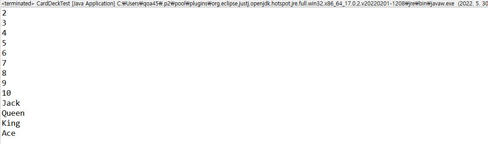

# 6장, 7장
## 275Page 3번
### 일반적인 경기를 나타내는 Sports클래스를 다음과 같이 정의한다.
``` java
class Sports{
  String getName() { return "아직 결정되지 않음"; }
  int getPlayers() ( return 0; )
}
```
### 이 클래스를 상속받아서 축구를 나타내는 클래스 Soccer를 작성하고 getName()과 getPlayers()를 재정의하여서 다음과 같은 출력이 나오도록 하라.
```
경기이름: 축구
경기자 수: 11
```
### 풀이과정
```

```

***
***
## 275Page 4번
### 일반적인 사각형을 나타내는 Rectangle 클래스가 다음과 같이 정의된다.
``` java
class Rectangle{
  int width, height;
  public Rectangle(int width, int height) {
    this.width = width;
    this.height = height;
    }
}
```
### 위의 Rectangle 클래스를 상속받아서 색이 있는 사각형을 나타내는 ColorRectangle 클래스를 정의한다. ColorRectangle 클래스에는 색상을 나타내는 필드 String color;가 추가된다. ColorRectangle 클래스의 생성자를 작성해보자. 다음과 같은 실행 결과가 나오도록 한다.
``` java
public static void main(String[] args){
  ColorRectangle obj = new ColorRectangle(100, 100, "blue");
  System.out.println("가로: "+obj.widht);
  System.out.println("세로: "+obj.height);
  System.out.println("색상: "+obj.color);
}
```
### 실행결과
```
가로: 100
세로: 100
색상: blue
```
### 풀이과정
```

```

***
***
## 317Page 7번
### java.util 패키지에 있는 Iterator 인터페이스를 구현하는 클래스 CardDeck을 작성하라. Iterator 인터페이스는 다음 메소드를 가지고 있다.
* boolean hasNext(): 반환할 요소가 있으면 true를 반환한다.
* Object next(): 반복의 다음 요소를 반환한다.
* void remove(): 이 반복자가 반환한 마지막 요소를 기본 컬렉션에서 제거한다.

### CardDeck 클래스 내부에 13장의 카드가 저장된 객체 배열을 가지고 있다. 첫 번째 next()호출은 카드 2를 반환하고 이어서 카드 3, 카드 4, ... 카드 Ace까지를 반환한다. 클래스 CardDeck을 테스트하기 위해 main() 메소드를 작성한다.
```
next()가 반환하는 값:2
next()가 반환하는 값:3
...
```
### 풀이과정
```

```


***
***
## 317Page 8번
### 객체의 어떤 값을 반환하는 메소드 double getValue()가 포함된 GetInfo 인터페이스를 정의한다. 이어서 GetInfo 인터페이스를 구현하는 Student 클래스를 작성한다. Student 클래스에서 getValue() 메소드는 학생의 학점을 반환한다. 각 객체들의 getValue()를 호출하여서 평균값을 계산하는 double average(Measurable[] objects) 메소드를 구현한다. 이 메소드를 이용하여 학생들의 평균 성적을 계산해보자.
### 풀이과정
```

```


